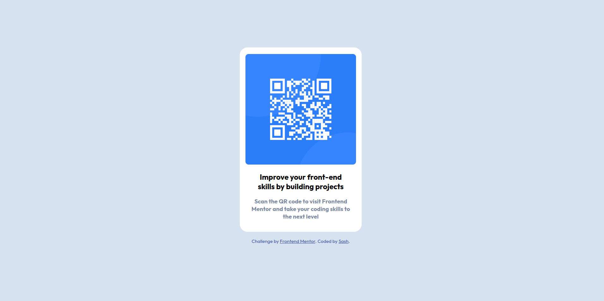

# QR Code Component

This project is a simple QR code component designed to improve front-end skills by building projects. It allows users to scan the QR code to visit Frontend Mentor and elevate their coding skills.

## Technologies Used

- HTML
- CSS
- [Outfit](https://fonts.googleapis.com/css2?family=Outfit:wght@400;700&display=swap) font

## Features

- Responsive design for both mobile and desktop views
- Stylish QR code presentation
- Clean and readable typography

## Usage

1. Clone the repository.
2. Open the `index.html` file in a web browser.

## Screenshots

## Credits

- Challenge by [Frontend Mentor](https://www.frontendmentor.io?ref=challenge)
- Coded by [Sash](#)

Feel free to customize the styles in the provided `style.css` file to suit your preferences.

# QR Code Component

This project is a simple QR code component designed to improve front-end skills by building projects. It allows users to scan the QR code to visit Frontend Mentor and elevate their coding skills.

## Technologies Used

- HTML
- CSS
- [Outfit](https://fonts.googleapis.com/css2?family=Outfit:wght@400;700&display=swap) font

## Features

- Responsive design for both mobile and desktop views
- Stylish QR code presentation
- Clean and readable typography

## Usage

1. Clone the repository.
2. Open the `index.html` file in a web browser with Open Live Server.

## Screenshots

## Credits

- Challenge by [Frontend Mentor](https://www.frontendmentor.io?ref=challenge)
- Coded by [Sash](#)

Feel free to customize the styles in the provided `style.css` file to suit your preferences.
